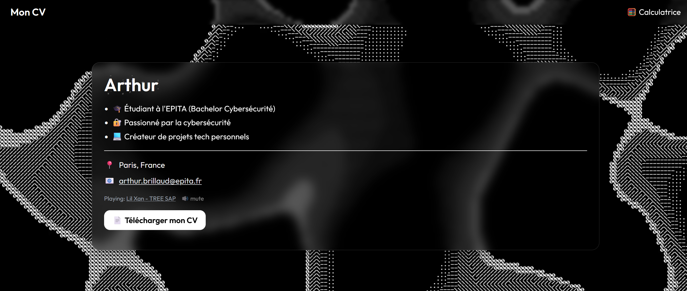
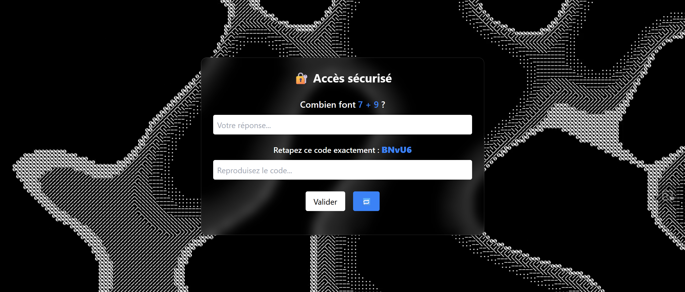
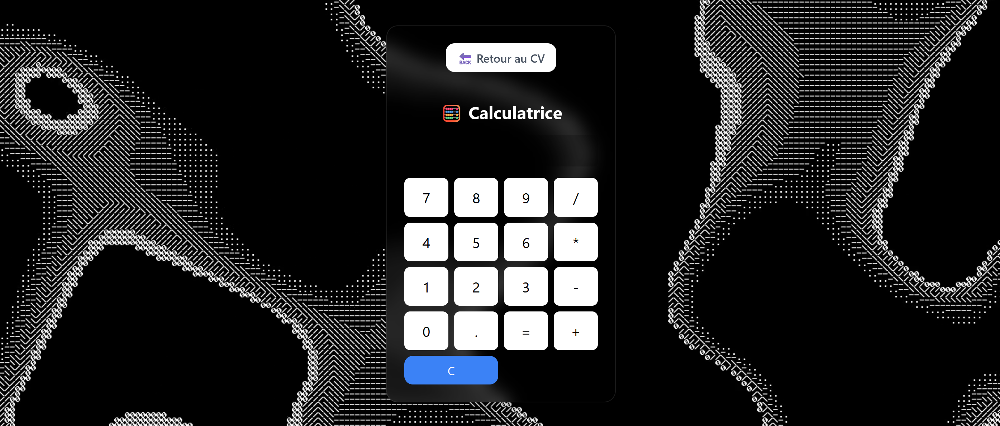

# CV-web

Ce projet inclut un **CV interactif** avec un système de **sécurisation d'accès** via un formulaire de vérification (calcul et code de sécurité). Il intègre également une **calculatrice** fonctionnelle pour permettre l'interaction de l'utilisateur avec l'interface.

## Fonctionnalités

### 1. **CV Interactif**
   - Un **CV minimaliste** avec des sections dynamiques.
   - Vidéo de fond (musique en option).
   - Un **bouton de téléchargement** du CV au format PDF.
   
   

### 2. **Accès Sécurisé**
   - Un formulaire pour valider l'accès avec deux étapes :
     - Un calcul à résoudre (affiché de manière dynamique).
     - Un **code de sécurité** généré aléatoirement que l'utilisateur doit réécrire correctement.
   - Si les réponses sont incorrectes, l'accès est bloqué après plusieurs tentatives.

   

### 3. **Calculatrice**
   - Une calculatrice fonctionnelle intégrée à l'application.
   - Interface soignée avec une **palette de couleurs** cohérente, comprenant un **fond de couleur noire avec un effet vidéo** et des boutons de couleur bleue et blanche.
   - Boutons colorés pour des interactions faciles et intuitives.

   

## Technologies Utilisées

- **HTML5** pour la structure du site.
- **CSS3 (avec TailwindCSS)** pour le style et la mise en page.
- **Vidéo de fond** pour améliorer l'apparence de la page et attirer l'attention.
  
## Installation

Pour utiliser ce projet sur votre propre machine, suivez les étapes suivantes :

1. Clonez le repository sur votre machine locale.
   ```bash
   git clone https://github.com/username/repository.git
